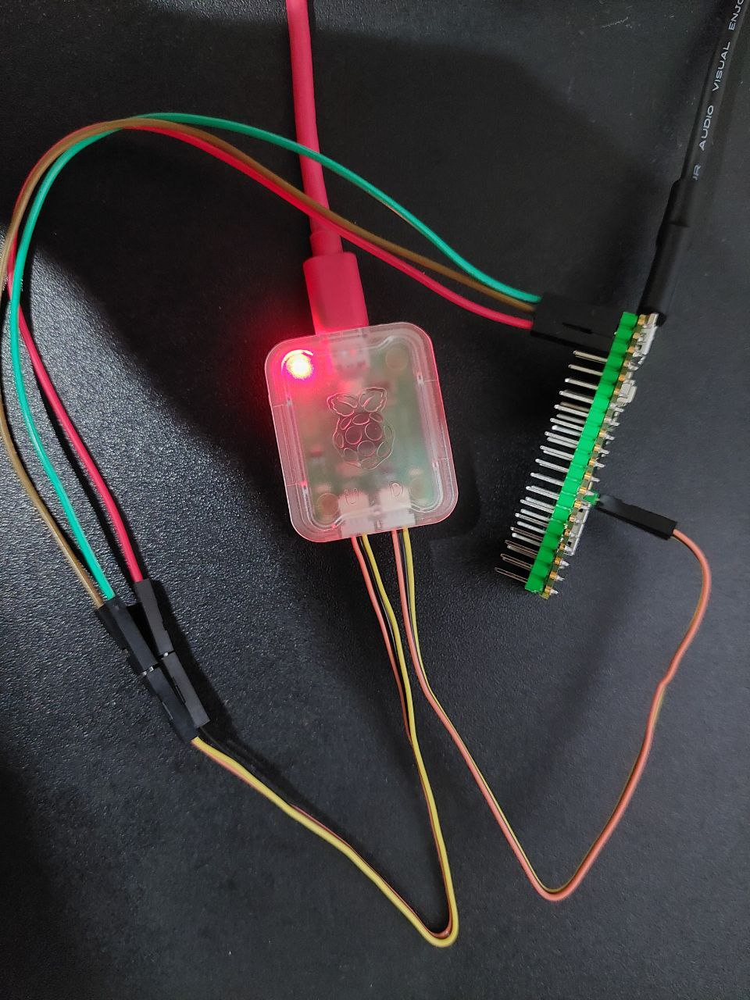

# Raspberry Pi Debug probe



# updating bt stack

when you try building a project, there would be an error

```shell
CMake Warning at /home/user/pico/pico-sdk/src/rp2_common/pico_btstack/CMakeLists.txt:10 (message):
  btstack submodule has not been initialized; Pico W BLE support will be
  unavailable.

              hint: try 'git submodule update --init' from your SDK directory (/home/user/pico/pico-sdk).

```

update the btstack

```shell
cd ~/pico/pico-sdk/
git submodule update --init
```

# creating a project

```shell
cd ~/pico/pico-project-generator
./pico_project.py --gui
```


# upload the program to the Pico

open two tabs:

1. connect to serial
2. build and upload the program

## connect to serial

```shell
minicom -b 115200 -o -D /dev/ttyACM0
```


## build and upload the program

```shell
cd test-w
mkdir build
cd build
export PICO_SDK_PATH=/home/user/pico/pico-sdk/
cmake -DPCIO_BOARD=pico_w ..
cmake -DCMAKE_BUILD_TYPE=Debug ..
cmake -j12
sudo openocd -f interface/cmsis-dap.cfg -f target/rp2040.cfg -c "adapter speed 5000" -c "program test-w.elf verify reset exit"
```

# debug using SWD

## terminal 1 - run openocd server

```shell
sudo openocd -f interface/cmsis-dap.cfg -f target/rp2040.cfg -c "adapter speed 5000"
```

## terminal 2 - run GDB

```shell

toolbox enter ubuntu-toolbox-22.04

gdb-multiarch test-w.elf
(gdb) target remote localhost:3333
Remote debugging using localhost:3333
warning: multi-threaded target stopped without sending a thread-id, using first non-exited thread
__breakpoint () at /home/user/pico/pico-sdk/src/rp2_common/pico_platform/include/pico/platform.h:269
269	    __asm__("bkpt #0");
(gdb) monitor reset init
target halted due to debug-request, current mode: Thread
xPSR: 0xf1000000 pc: 0x000000ea msp: 0x20041f00
target halted due to debug-request, current mode: Thread
xPSR: 0xf1000000 pc: 0x000000ea msp: 0x20041f00
(gdb) continue
```

# References

- https://www.raspberrypi.com/documentation/microcontrollers/debug-probe.html
